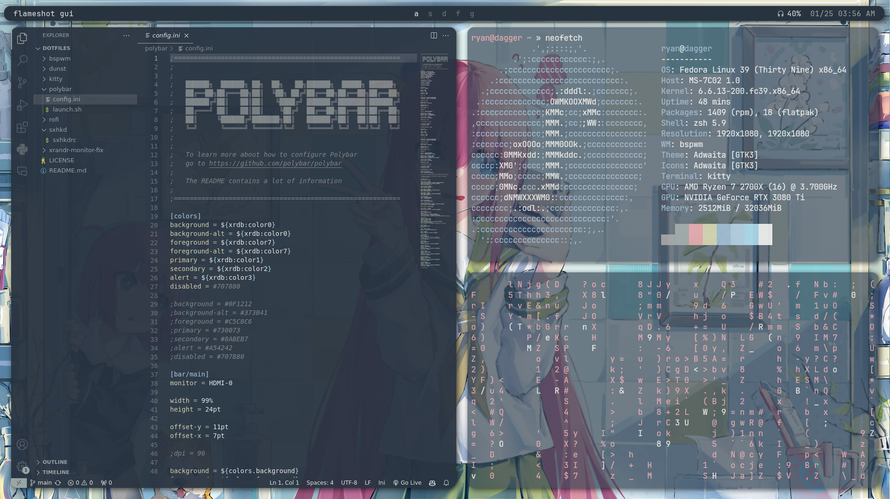

# dotfiles

presets for linux environment

## specs

WM: bspwm

Bar: polybar

Launcher: rofi

Terminal: kitty

Shell : zsh

## cool plugins and extra util
dunst

picom

lxappearance

xarchiver

thunar

pywal

cmatrix

## to install

eww (learning)

## applications

vscode

gimp

bitwarden

discord

spotify

obsidian

flameshot
