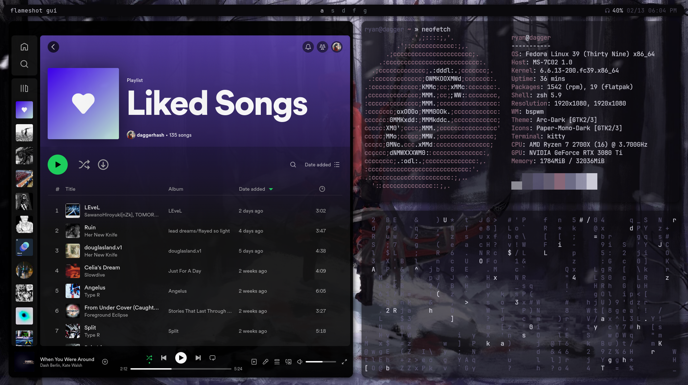

# dotfiles

> desktop environment

## desktop

### specs

Distro: Fedora 40

WM: hyprland (sway)

DM: sddm

Bar: waybar

Launcher: wofi

Terminal: kitty

Shell : zsh

### cool plugins and extra util

dunst

lxappearance

pcmanfm

qt6ct

### applications

vscode gimp bitwarden discord spotify obsidian font-manager xarchiver

### reminders

1. enable graphical login manager
2. edit nano to display lines
3. edit waybar to match monitors

## mac

Distro: Fedora 39 Asahi Remix

WM: hyprland

Bar: waybar

Launcher: wofi

Terminal: kitty

Shell: zsh

### cool plugins and extra util

kde desktop environment just in case i need its utilities

thunar

pywal

### to install

notification daemon

### applications

vscode gimp ncspot bitwarden
