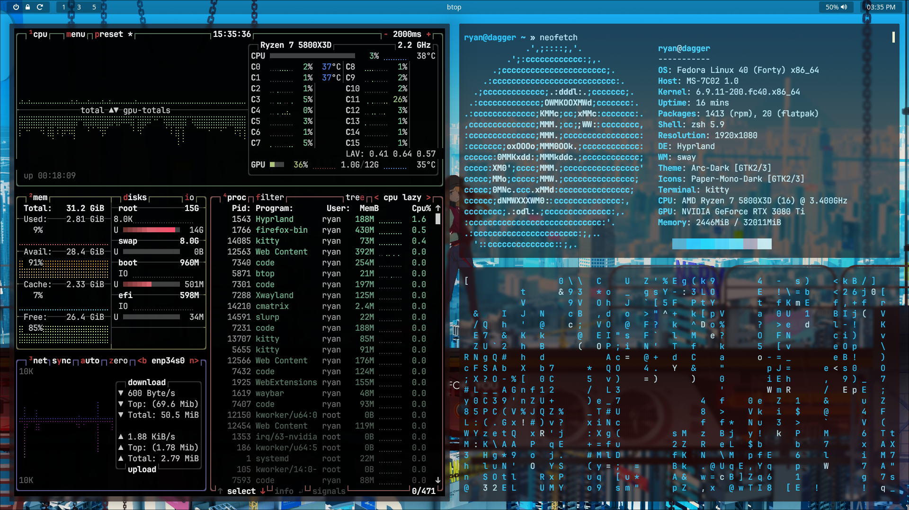

# dotfiles

> desktop environment

### specs

Distro: Fedora 40

DE: hyprland

WM: sway

DM: sddm

Bar: waybar

Launcher: wofi

Terminal: kitty

Shell : zsh

Notification Daemon : dunst

### cool plugins and extra util

nwg-look

pcmanfm

qt6ct

### theming

arc-dark

paper-mono-dark

pywal for colors

### applications

vscode gimp bitwarden discord spotify obsidian font-manager xarchiver

### reminders

1. enable graphical login manager on server edition
2. edit nano to display lines (and fix tab)
3. edit waybar to match monitors
