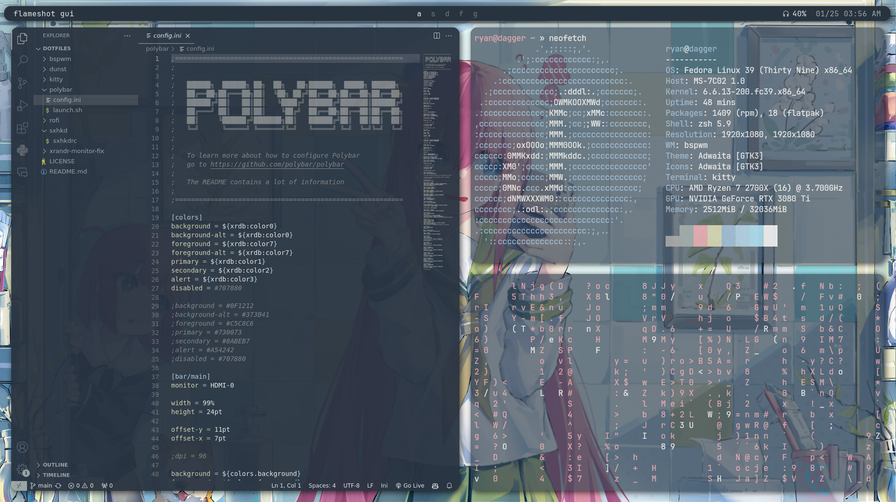
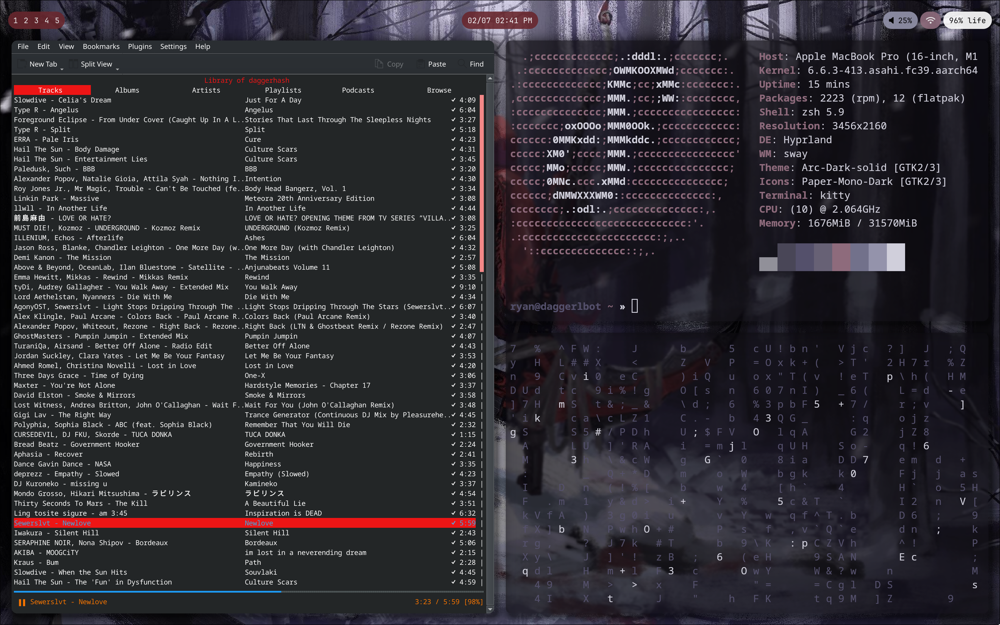

# dotfiles

> desktop environment

> mac enviroment

## desktop

### specs

Distro: Fedora 39

WM: bspwm

Bar: polybar

Launcher: rofi

Terminal: kitty

Shell : zsh

### cool plugins and extra util

dunst

picom

lxappearance

qt5ct

xarchiver

thunar

pywal

### to install

eww (learning)

### applications

vscode gimp bitwarden discord spotify obsidian flameshot

## mac

Distro: Fedora 39 Asahi Remix

WM: hyprland

Bar: waybar

Launcher: wofi

Terminal: kitty

Shell: zsh

### cool plugins and extra util

kde desktop environment just in case i need its utilities

thunar

pywal

### to install

notification daemon

### applications

vscode gimp ncspot